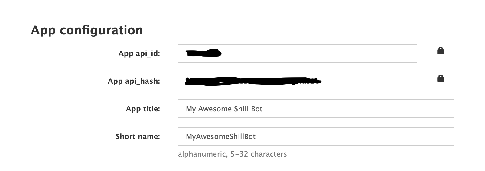

# Telegram Shill Bot
Ever wanted a Shill Bot but wankers keep scamming for one OR wanted to charge you an arm and a leg?

This is a simple bot written in Python that you can use to shill (i.e. send messages) your token, or whatever, to Telegram channels.

There are a couple of runtime options available (one easy, one hard), so please read the entire doc. The `easy` runtime will most likely work (but not tested) on Windows, since it is ran via a Docker container.

## Speaking Of Shilling
If you find this bot useful, please consider donating any token of value to our BSC wallet:
`0xb973B103c83E467f27D04e9F31F70aaf1A83d595`. Just as an example, some paid shill bots cost **~$500.00**, with few additional features.

Our goal is simple: to earn enough money to build a [surf ranch](https://www.flowrider.com/product/flowbarrel-ten/) business.

This project is free to everyone (except those wankers), and expect more kick ass projects soon!

You can ask us questions in: https://t.me/surfranch1

## <span style="color:red">WARNING</span> ##
This can cause your account to be rate limited and even banned if you shill too often. A safe `wait_interval` is typically around 900 seconds.

## ToC
* [Setup](#setup)
* [Running](#running)
  + [Easy](#easy)
  + [Not As Easy](#not-as-easy)
  + [Telegram Prompt](#telegram-prompt)
* [Stopping](#stopping)
* [Tested With](#tested-with)
* [Contribute](#contribute)
* [ToDo](#todo)

## Setup
- Obtain a Telegram API ID
  - https://core.telegram.org/api/obtaining_api_id

- Grab your `api_id`, `api_hash`, and app `short name`
  - https://my.telegram.org/apps
  

- Create a copy of `settings.example.yml` and name it `settings.yml`

- Fill out the `settings.yml` with your app configuration details
  - **BEFORE**
    ```yaml
    ---

    api_id: API_ID
    api_hash: API_HASH
    app_short_name: APP_SHORT_NAME
    ...
    ```
  - **AFTER**
    ```yaml
    ---

    api_id: 123456
    api_hash: abc123xyz456
    app_short_name: MyAwesomeShillBot
    ...
    ```

- Fill out the `settings.yml` with the message(s) you want to shill
  - **BEFORE**
    ```yaml
    ...
    messages:
      one: |
        this is message 1
        it can be whatever you want it to be
      two: |
        this is message 2
        again, it can be whatever you want it to be
        so you can have some variation
    ...
    ```
  - **AFTER**
    ```yaml
    ...
    messsages:
      one: |
        i will be whatever you define me to be
      two: |
        and so will i
    ...
    ```

- Fill out the `settings.yml` with the channel(s) you want to shill, and how you want to shill them (i.e. what message you would like to send)
  - Please make sure you are using the official Telegram channel name and not what is shown in the channel title
    - e.g. The official Telegram channel name for `https://t.me/surfranch1` is `surfranch1`, even though the channel title is `SurfRanch`
    - This can be obtained by viewing the channel info
  - **BEFORE**
    ```yaml
    ...
    raid:
      CHANNEL_NAME:
        message_type: one
        wait_interval: 3
      SOME_OTHER_CHANNEL_NAME:
        message_type: two
        wait_interval: 300
    ```
  - **AFTER**
    ```yaml
    ...
    raid:
      cryptoblank:
        message_type: one
        # ^^ this maps to a message "name" you created earlier
        wait_interval: 1800
        # ^^ this is in seconds
      tsamoon:
        message_type: two
        wait_interval: 900
    ```

- Verify your YAML by copying all of `settings.yml` and paste it into http://www.yamllint.com/
  - Fix any reported errors

- Sign into the Telegram channels you plan to shill, using the account you plan to shill with
  - This should fix any `CAPTCHA` guards that may be in place

## Running
### Easy
- Install Docker
  - https://docs.docker.com/engine/install/
#### From Your Terminal
- Run the Docker bot script
  ```bash
  ./build_n_run.sh
  ```

### Not As Easy
#### From Your Terminal
- Install Python packages
  ```bash
  python3 -m venv venv
  source venv/bin/activate
  pip install -r requirements.txt
  ```
- Run the bot
  - ```bash
    python tg_shill_bot.py
    ```

### Telegram Prompt
You will be prompted to enter your phone (or bot token) and the Telegram code you received - please fill it out.


## Stopping
- Whether running in Docker or locally, `Ctrl+C` should stop the process

## Tested With
- `macOS Catalina v10.15.7`
- ```bash
  $ python --version
  Python 3.7.5
  $ pip --version
  pip 19.2.3 from ... (python 3.7)
  ```
- 3 unique Telegram channels
- 3 unique messages

## Contribute
- We welcome any contribution to the project (issues and PRs)
- If you have any code to contribute, please follow the fork, branch, PR process

## ToDo
- Solve join captchas:
  - Rose simple button click: Can use simple telethon
  - Alphabet captchas: Can use some optical character recognition
  - Sum of integers or logical operations: OCR, identify operator and perform the logic
- Add some `random` message getter from list of messages vs hard mapping
- Add some rate limiting aspect. Not sure what the limit ...
  - Maybe if possible have 1 app connect and keep session and channel logged in state. Then the other
    that does the shilling which interacts with first. The first stays connected at all times to avoid the JoinChannelRequest flood.
- Account rotation to not get banned or rate limited ...
- Add unit tests
- UI maybe if we want to get fancy with this
  - Or use existing tg clients with something like pyautogui

##### Keywords
bot
shill, shillbot, shill bot
telegram, telegram shill, telegram shillbot, telegram shill bot
